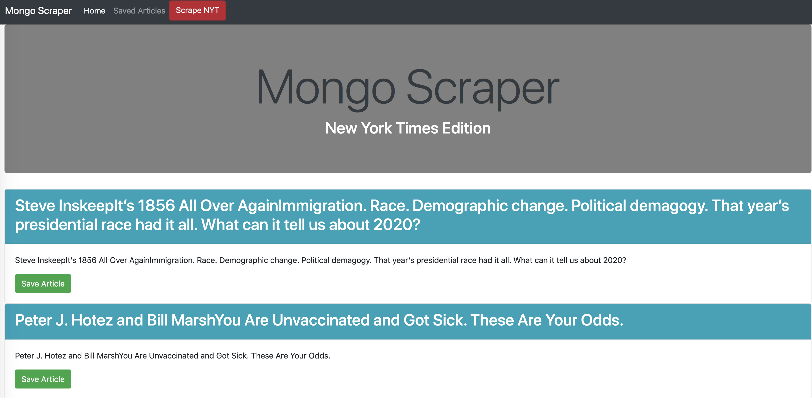
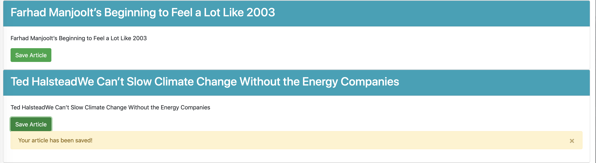
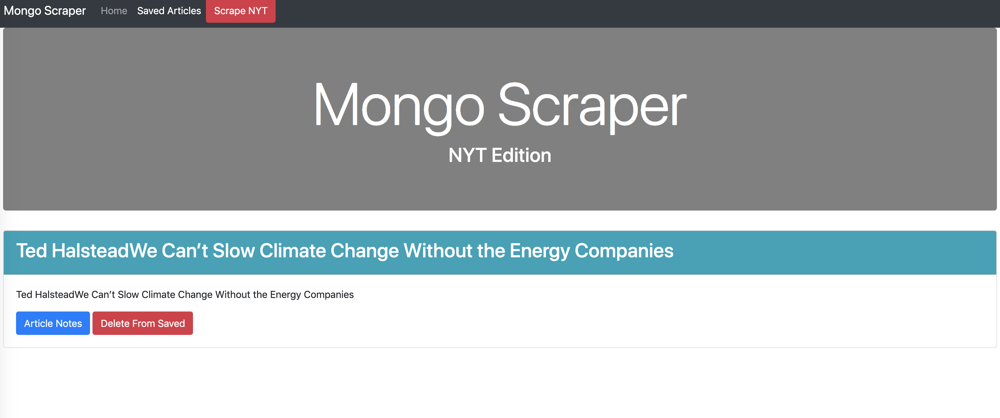

# Mongo-News

## Overview

In this assignment, you'll create a web app that lets users view and leave comments on the latest news. But you're not going to actually write any articles; instead, you'll flex your Mongoose and Cheerio muscles to scrape news from another site.

### Click Scrape NYT to get the news.

### If you like an article you can SAVE ARTICLE to keep it with other saved articles.

### Your saved article then is placed in the saved article section where you can then delete the article or make notes.

